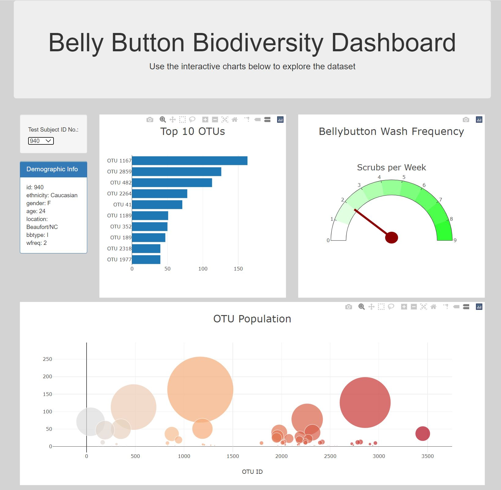
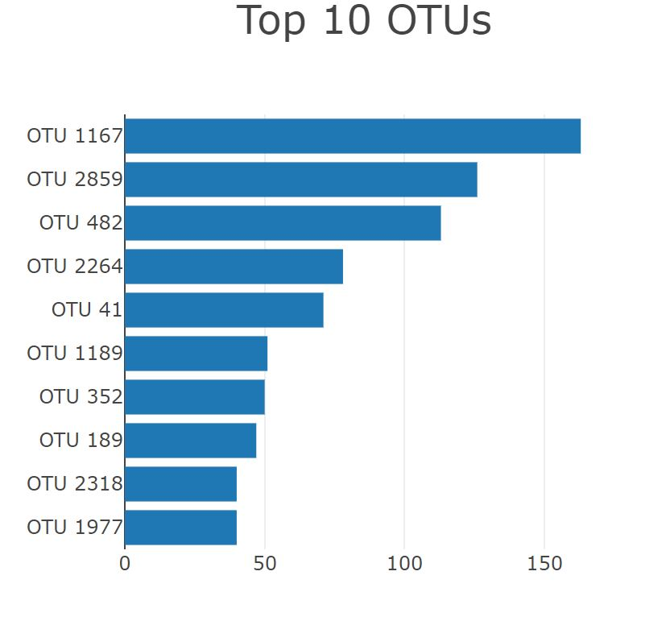
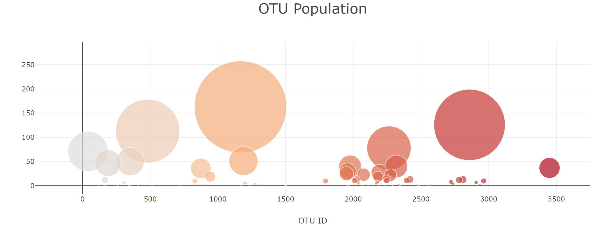
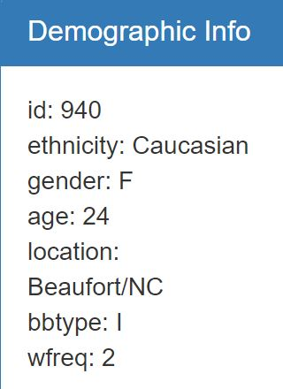
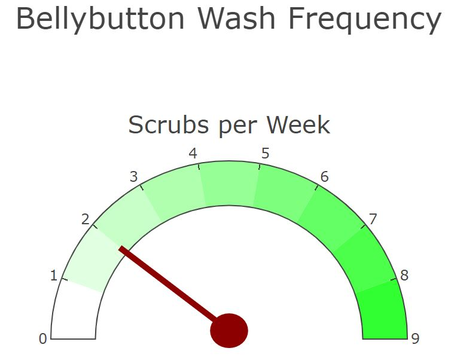

# interactive-visualuzations-challenge
interactive visualizations

## Background
There is stuff living in your belly button. GROSS! Just take a look at what we found in each of our test subjects' navels.
Scrub every day, folks!

## Step 1: Plotly
* Used D3 library to read data file samples.json
* Created horizontal bar chart to display each test subject's top 10 OTUs

* Created bubble chart to display each sample

* Displayed test subject's demographic data

* All plots are updated when a new sample is selected

## Advanced Challenge Assignment
* Created gauge chart to display test subject's washing frequency
